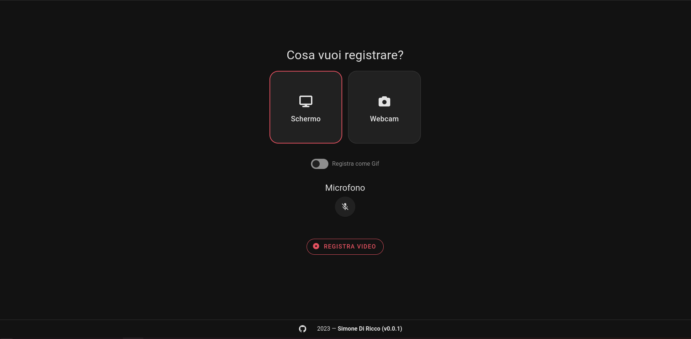
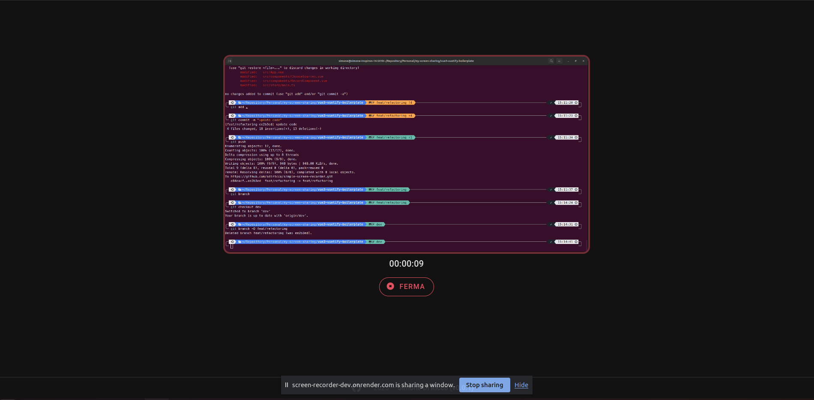
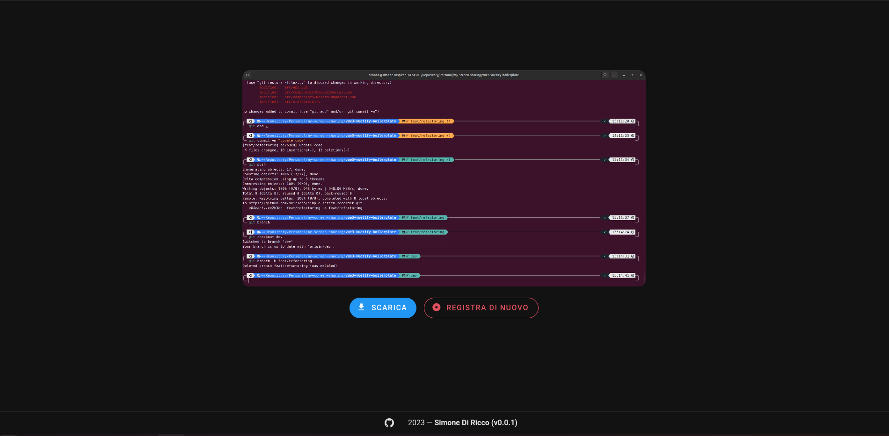

# Screen Recorder

Trovi l'applicazione online su [screen-recorder-dev.onrender.com](https://screen-recorder-dev.onrender.com/#/home).

L'applicazione registra il video dallo schermo o dalla webcam, permette di registrare come `.gif` o come `.webm` e permette la cattura dell'audio





## Project setup

```
yarn
```

### Compiles and hot-reloads for development

```
yarn dev
```

### Compiles and minifies for production

```
yarn build
```

### Customize configuration

See [Configuration Reference](https://vitejs.dev/config/).
